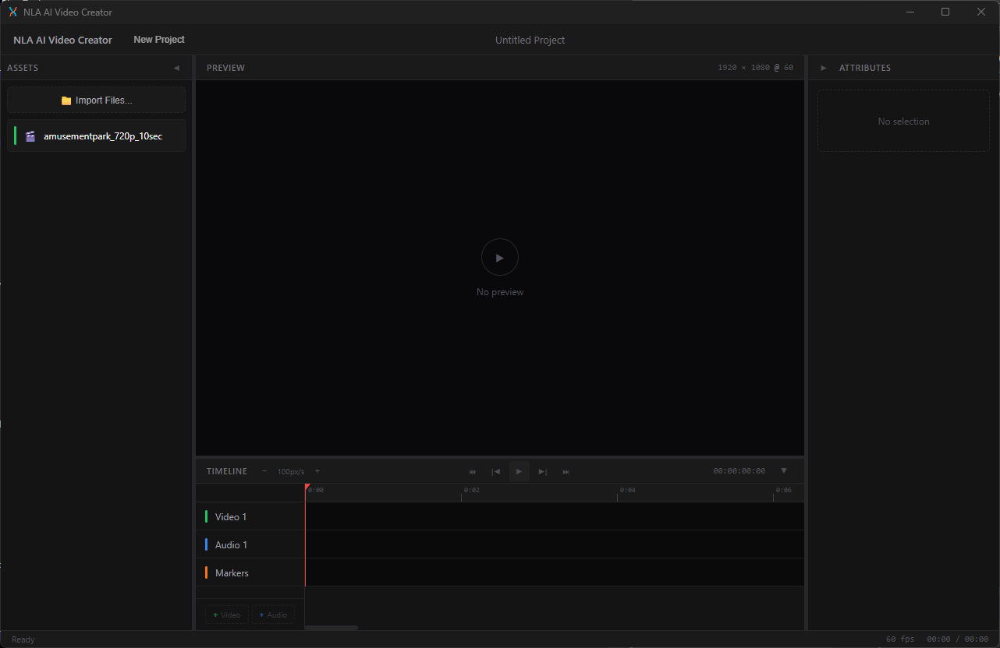

# NLA AI Video Creator



> **A local-first, AI-native Non-Linear Animation editor for generative video production.**

Built with **Rust** and **Dioxus 0.7** for a fast, native desktop experience.

## Documentation

- **[Project Overview](./docs/PROJECT.md)** — Vision, architecture, roadmap, and development setup
- **[Content Architecture](./docs/CONTENT_ARCHITECTURE.md)** — How assets, generation, and the timeline work together

## Quick Start

```bash
# Prerequisites: Rust 1.75+, Dioxus CLI, FFmpeg dev libraries, FFmpeg tools on PATH

# Run in development mode
cargo run

# Build for release
cargo build --release
```

## FFmpeg Build Prereqs

This project links against FFmpeg for in-process decode. Install the FFmpeg dev
libraries for your OS:

- Windows (vcpkg): `vcpkg install ffmpeg[avcodec,avformat,avfilter,swscale,swresample] --triplet x64-windows`
- macOS (Homebrew): `brew install ffmpeg`
- Linux (Debian/Ubuntu): `sudo apt install libavcodec-dev libavformat-dev libavutil-dev libswscale-dev libswresample-dev`

On Windows, ensure `VCPKG_ROOT` points to your vcpkg clone (for example
`C:\vcpkg2`) before running `cargo check`.

Keep `ffmpeg`/`ffprobe` on PATH for media probing tools.

See [docs/PROJECT.md](./docs/PROJECT.md) for full setup instructions.

## License

**MIT License** — See [LICENSE](./LICENSE) for details.
